| Python | Bash | Rust | R |
|:------:|:----:|:----:|:-:|
|   |   |   |  |

| Google Cloud | AWS | Unix | Linux | Windows |
|:---------------:|:---:|:----:|:-----:|:-------:|
|  |  |  |  |  |

| Spark | Scikit- Learn | Pytorch | Tensorflow | Hugging Face |
|:-----:|:----------------:|:-------:|:----------:|:------------:|
|  |  |  |  |  |
| Git | Docker | NeoVim | Tmux | DBT |
|  |  |  | 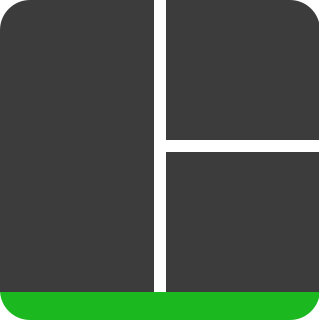 |  | 
| PostgreSQL | Redis | SQLite | DuckDB | Polars |
|  |  |  | |  |
| OpenAI | Mistral | Anthropic | Cohere | llama.cpp |
|  | 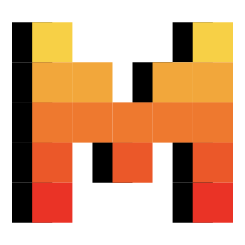 |  |  | 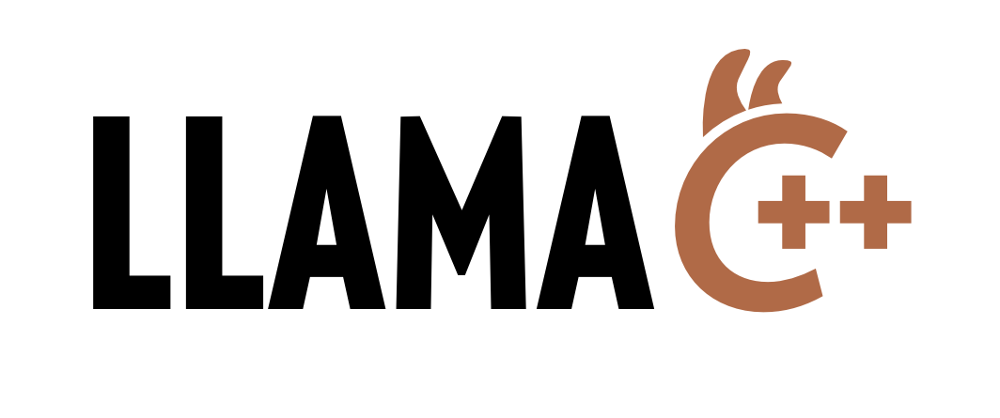 |
| Flask | pytest | Pylint | Black | Poetry |
| | |  | |  | |
| Cloud Run | Compute Engine | BigQuery | FireStore | Pub/Sub | 
| | 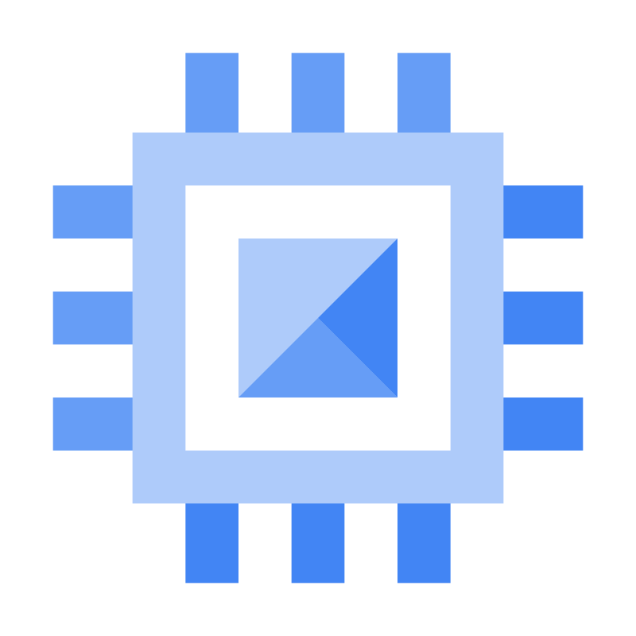Engine" alt="Compute Engine" width="55" height="55"/>|  ||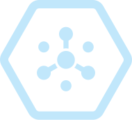|
| Lambda    | EC2               | Simple Email Service | Athena   | dynamodb      |
| 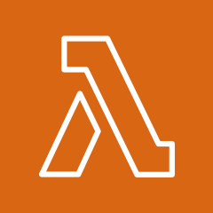 | 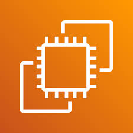 |  | 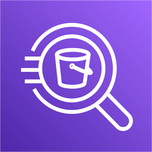 | 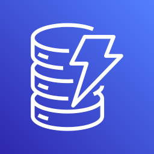 |
| SNS       | SQS               | Data Firehose |          |               |
|  |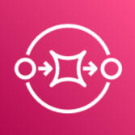 | 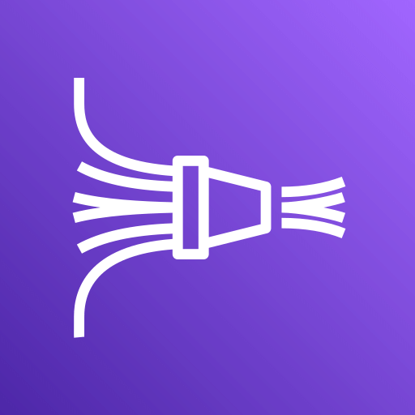 |          |               |
| OWASP | Locust | Dash | Streamlit | Selenium |
|  | 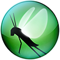 | | |  |

Still to add: sql server, nltk, rustworkx, matplotlib, numpy, selenium, beautifulsoup, tidyverse
